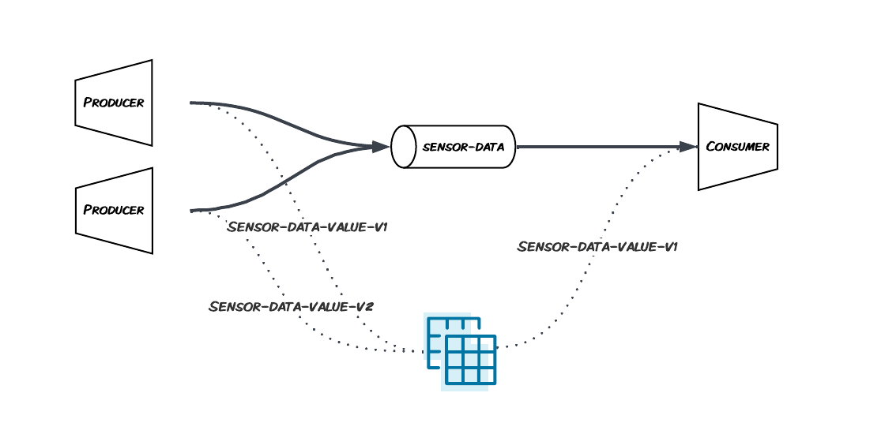

# Spring Cloud Stream - Schema Registry Integration

Running the following steps it's possible to launch 2 Spring Cloud Stream applications, the first one will generate and consumer random "sensor" data produced with the first version of a schema. The second one will produce messages with an updated version of the schema, these messages will be read by the previous consumer as well.



## Export variables

```
export BOOTSTRAP_SERVER=
export KAFKA_API_KEY=
export KAFKA_API_SECRET=
export SR_URL=
export SR_API_KEY=
export SR_API_SECRET=
```

## Maven Avro Plugin

Both projects make use of the [Avro Maven Plugin](https://mvnrepository.com/artifact/org.apache.avro/avro-maven-plugin), It's possible to generate automatically the `sensor` POJO using the code below. `mvn install` it's needed to run the generation of the code.

```
            <plugin>
                <groupId>org.apache.avro</groupId>
                <artifactId>avro-maven-plugin</artifactId>
                <version>${avro.version}</version>
                <executions>
                    <execution>
                        <phase>generate-sources</phase>
                        <goals>
                            <goal>schema</goal>
                        </goals>
                    </execution>
                </executions>
                <configuration>
                    <sourceDirectory>${project.basedir}/src/main/resources/avro</sourceDirectory>
                    <outputDirectory>${project.basedir}/src/main/java</outputDirectory>
                    <includes>
                        <include>**/*</include>
                    </includes>
                    <stringType>String</stringType>
                </configuration>
            </plugin>
```

## Create both producer and consumer using schema v1

Run application v1 on one shell and keep it running.

```
cd v1
mvn install
mvn spring-boot:run
```

## Set FORWARD Compatibility Mode

We are going to add 2 new fields to our object and we'll upgrade the producer first. Let's set `FORWARD` compatibility mode.

```
curl -X PUT -H "Content-Type: application/vnd.schemaregistry.v1+json" \
       --data '{"compatibility": "FORWARD"}' \
       -u ${SR_API_KEY}:${SR_API_SECRET} \
       ${SR_URL}/config/sensor-data-value

curl -u $SR_API_KEY:$SR_API_SECRET $SR_URL/config/sensor-data-value
```

## Create producer only using schema v2

Run application v2 on one shell and keep it running.

```
cd v2
mvn install
mvn spring-boot:run
```

## Results

We have one subject `sensor-data-value` with schema at version 1 and version 2.

```
curl -u $SR_API_KEY:$SR_API_SECRET $SR_URL/subjects/sensor-data-value/versions
curl -u $SR_API_KEY:$SR_API_SECRET $SR_URL/subjects/sensor-data-value/versions/1 | jq
curl -u $SR_API_KEY:$SR_API_SECRET $SR_URL/subjects/sensor-data-value/versions/2 | jq
```

We were able to run at the same time:

- 2 producers, one using schema version 1 and another using schema version 2
- 1 consumer, reading messages using schema version 1
